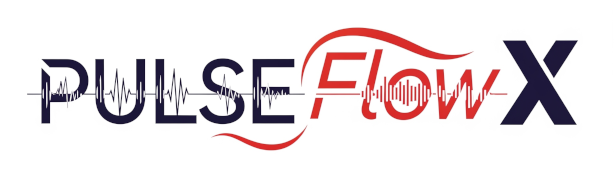

<div align="center">
  
</div>

# PulseFlowX: Advanced FIR-Based fMRI Threat Processing Pipeline

<div align="center">

[](https://www.python.org/downloads/)
[](https://opensource.org/licenses/MIT)
[](https://afni.nimh.nih.gov/)
[](https://en.wikipedia.org/wiki/Finite_impulse_response)
[](https://en.wikipedia.org/wiki/Functional_magnetic_resonance_imaging)
[](https://github.com/psf/black)

</div>

**PulseFlowX** is a comprehensive AFNI-based pipeline for **Finite Impulse Response (FIR)** analysis of sustained and phasic threat responses in fMRI data, with advanced group comparisons between Alcohol Use Disorder (AUD) and Healthy Controls (HC). This pipeline leverages FIR deconvolution methods to capture the full temporal dynamics of neural responses to threat stimuli.

## Features

- **FIR deconvolution analysis** using AFNI's TENT basis functions
- **Complete preprocessing pipeline** with AFNI tools
- **Sustained vs Phasic analysis** for comprehensive threat response characterization
- **ROI analysis** with subject-specific masks
- **Group comparisons** with publication-quality statistics
- **Automated visualizations** and reporting

## Quick Start

1. **Install dependencies:**
```bash
pip install -r requirements.txt
```

2. **Organize your data:**
```
Data/
├── sub-ALC2158/
│   ├── anat/sub-ALC2158_T1w.nii
│   └── func/sub-ALC2158_task-unpredictablethreat_run-1_bold.nii
└── ...
```

3. **Configure groups:**
```bash
python pulseflow_00_setup.py --add sub-ALC2158 AUD
python pulseflow_00_setup.py --add sub-ALC2161 HC
```

4. **Run the PulseFlowX pipeline:**
```bash
# Step 1: Preprocessing
python pulseflow_01_preprocess.py

# Step 2: Sustained/Phasic Analysis
python pulseflow_02_dynamics.py

# Step 3: ROI Analysis (requires subject-specific masks)
python pulseflow_03_roi.py --roi amygdala --hemisphere left

# Step 4: Group Analysis & Publication Outputs
python pulseflow_04_stats.py
```

## Pipeline Components

### `pulseflow_00_setup.py`
- Group assignment management
- Subject organization utilities
- Initial pipeline configuration

### `pulseflow_01_preprocess.py`
- Slice timing correction, despiking, motion correction
- GLM analysis with contrast calculations
- Quality control generation

### `pulseflow_02_dynamics.py`
- **FIR deconvolution** to extract sustained (0-20s) and phasic (0-14s) responses
- TENT basis functions for temporal dynamics modeling
- Group-level statistical comparisons
- Contrast generation for threat processing conditions

### `pulseflow_03_roi.py`
- ROI-based activation extraction
- Subject-specific mask support (left/right hemisphere analysis)
- Individual and group-level statistics

### `pulseflow_04_stats.py`
- Publication-quality statistical tables
- Comprehensive visualizations
- Effect size calculations and significance testing

## ROI Analysis Setup

For ROI analysis, place subject-specific masks in:
```
processed_data/roi_analysis/subject_masks/
├── sub-2158_Amyg_L_DWI.nii.gz
├── sub-2158_Amyg_R_DWI.nii.gz
└── ...
```

## Output Structure

```
processed_data/
├── glm_results/           # GLM analysis outputs
├── sustained_phasic_analysis/  # Sustained/phasic responses
├── roi_analysis/          # ROI extraction results
└── publication_outputs/   # Publication-ready tables & figures
    ├── figures/           # High-quality visualizations
    ├── tables/            # Statistical results
    └── GROUP_ANALYSIS_REPORT.md
```

## Requirements

- **AFNI** (version 23.0+) with FIR deconvolution capabilities
- **Python 3.8+**
- **Subject-specific ROI masks** in ORIG space
- Sufficient computational resources for FIR analysis

## Citation

If you use PulseFlowX, please cite the relevant AFNI tools and consider referencing this repository.

## Author & Lab

**PulseFlowX** was developed by **Ozgun Ozalay** (oozalay@unmc.edu) at the **Blackford Emotional Neuroscience Lab**, Mind & Mental Health Institute (MMI), University of Nebraska Medical Center (UNMC).

### Lab Information
- **Lab**: Blackford Emotional Neuroscience Lab
- **Institution**: Mind & Mental Health Institute (MMI), University of Nebraska Medical Center (UNMC)
- **Contact**: oozalay@unmc.edu

## License

This project is licensed under the MIT License.
